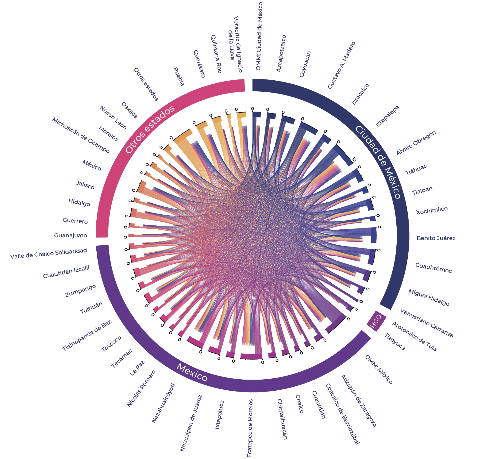

<!-- README.md is generated from README.Rmd. Please edit that file -->

```{r, include = FALSE}
knitr::opts_chunk$set(
  collapse = TRUE,
  comment = "#>"
)
```

# Prontuario de Migración 2010 - 2020

<!-- badges: start -->
<!-- badges: end -->


Este repositorio contiene el prontuario de migración interna en México, abarcando un periodo de 20 años, desde 2010 hasta 2020. El objetivo es proporcionar una evaluación detallada de los diferentes tipos de migración y movilidad dentro del país.

{ width=800px }

## Contenido

El prontuario está estructurado en diferentes categorías de migración y movilidad, cada una con sus respectivos scripts y datos:

### Tipos de Migración

- **Migración reciente (MR5a)**: Evaluación de la migración en los últimos 5 años a nivel municipal, intramunicipal e intermunicipal.
- **Migración de nacimiento (MNac)**: Datos sobre la migración desde el lugar de nacimiento.
- **Movilidad laboral (MTrab)**: Información sobre la movilidad relacionada con el trabajo.
- **Movilidad estudiantil (MEst)**: Datos sobre la movilidad relacionada con la educación.
- **Migración de retorno (MRt)**: Información sobre la migración de retorno.
- **Zonas Metropolitanas (ZM)**: Evaluación de la migración dentro de las zonas metropolitanas, a nivel municipal, intramunicipal e intermunicipal.

### Estructura de los Archivos

- **Migración reciente 2010 - 2020** (Nivel Estatal y Municipal)
    - Migración reciente 1985-1990
    - Migración reciente 1995-2000
    - Migración reciente 2005-2010
    - Migración reciente 2010-2015
    - Migración reciente 2015-2020
- **Migración de nacimiento 2010 - 2020** (Nivel Estatal)
    - Migración de nacimiento 2020 [[Chord Diagram]](https://dvillasanao.github.io/Prontuario_migracion_interna/images/MNac2020.html) [[Script]](https://dvillasanao.github.io/Prontuario_migracion_interna/R//02%20Migracion%20de%20nacimiento%202010%20-%202020/02.05%20Migracion%20de%20nacimiento%202020/02.05.01-Migracion-de-nacimiento-2020.html)    
    - Migración de nacimiento 2015
    - Migración de nacimiento 2010
    - Migración de nacimiento 2000
    - Migración de nacimiento 1990
- **Movilidad laboral 2010 - 2020** (Nivel Estatal y Municipal)
    - Movilidad laboral 2010
    - Movilidad laboral 2015
    - Movilidad laboral 2020
- **Movilidad estudiantil 2010 - 2020** (Nivel Estatal y Municipal)
    - Movilidad estudiantil 2015
    - Movilidad estudiantil 2020 [[Chord Diagram]](https://dvillasanao.github.io/Prontuario_migracion_interna/images/MEst_2020.html)[[Script]](https://dvillasanao.github.io/Prontuario_migracion_interna/R/04%20Movilidad%20estudiantil%202015-%202020/04.02%20Movilidad%20estudiantil%202020/04.02.01-Movilidad-estudiantil-2020.html)
- **Migración de retorno 2010 - 2020** (Nivel Estatal y Municipal)
    - Migración de retorno 2010
    - Migración de retorno 2015
    - Migración de retorno 2020
- **Zonas Metropolitanas 2010 - 2020** (Nivel Estatal, Municipal y Metropolitano)
    - Zonas Metropolitanas 2010
    - Zonas Metropolitanas 2015
    - Zonas Metropolitanas 2020 [[MEst_2020]](https://dvillasanao.github.io/Prontuario_migracion_interna/R/06%20Zonas%20Metropolitanas%202010%20-%202020/06.03%20Zonas%20Metropolitanas%202020/06.03.04%20Movilidad%20estudiantil%202020/06.03.04.01-Movilidad-estudiantil-2020.html)    

## Uso del Repositorio

Los Scripts y Datos que se encuentran organizados en carpetas por tipo de migración y año.

```
git clone <https://github.com/usuario/Prontuario_migración_interna.git>

```

## Contacto

Contacto: @dvillasanao