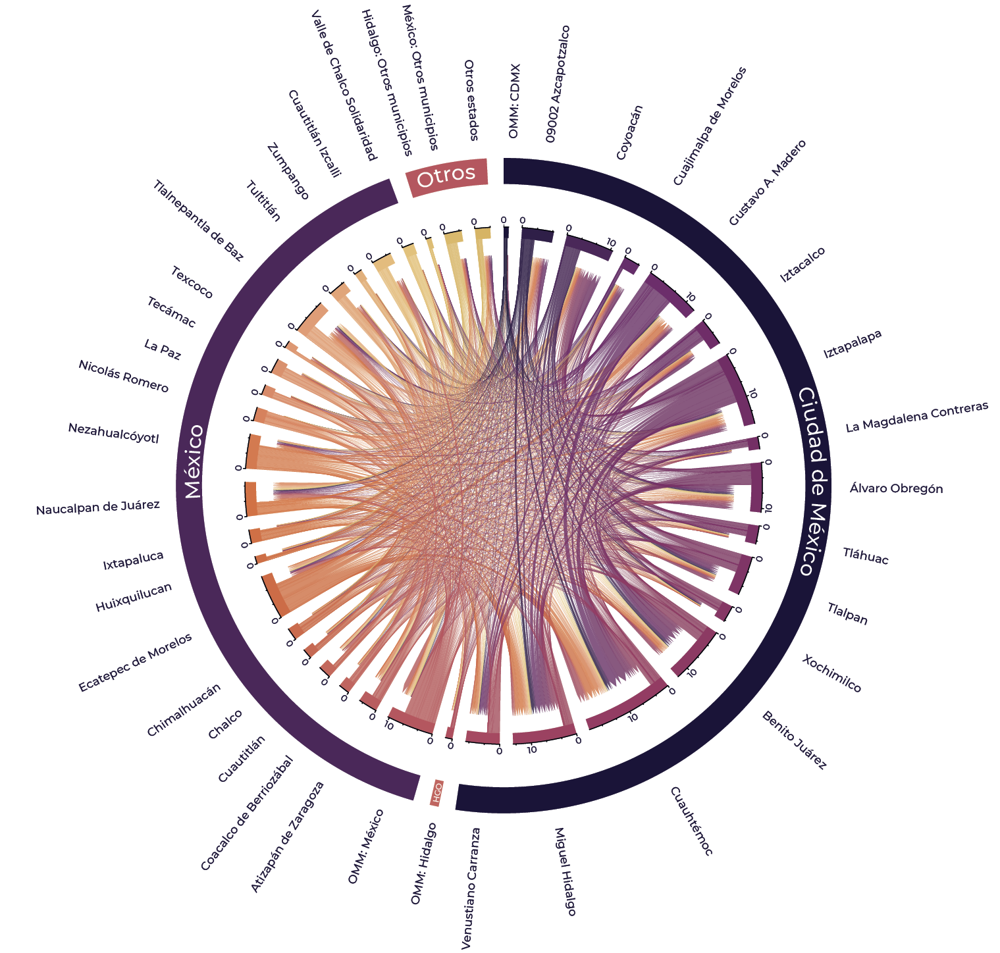

<!-- README.md is generated from README.Rmd. Please edit that file -->

# Prontuario de Migración 2010 - 2020

<!-- badges: start -->
<!-- badges: end -->

Este repositorio contiene el prontuario de migración interna en México,
abarcando un periodo de 20 años, desde 2010 hasta 2020. El objetivo es
proporcionar una evaluación detallada de los diferentes tipos de
migración y movilidad dentro del país.

<figure>

<figcaption aria-hidden="true">Elaboración propia: Movilidad laboral de
la Zona Metropolitana de la Ciudad de México, 2020.</figcaption>
</figure>

## Contenido

El prontuario está estructurado en diferentes categorías de migración y
movilidad, cada una con sus respectivos scripts y datos:

### Tipos de Migración

- **Migración reciente (MR5a)**: Evaluación de la migración en los
  últimos 5 años a nivel municipal, intramunicipal e intermunicipal.
- **Migración de nacimiento (MNac)**: Datos sobre la migración desde el
  lugar de nacimiento.
- **Movilidad laboral (MTrab)**: Información sobre la movilidad
  relacionada con el trabajo.
- **Movilidad estudiantil (MEst)**: Datos sobre la movilidad relacionada
  con la educación.
- **Migración de retorno (MRt)**: Información sobre la migración de
  retorno.
- **Zonas Metropolitanas (ZM)**: Evaluación de la migración dentro de
  las zonas metropolitanas, a nivel municipal, intramunicipal e
  intermunicipal.

### Estructura de los Archivos

- **Migración reciente 2010 - 2020** (Nivel Estatal y Municipal)
  - Migración reciente 1985-1990
  - Migración reciente 1995-2000 [\[Chord
    Diagram\]](https://dvillasanao.github.io/Prontuario_migracion_interna/images/MR5a_2000.html)
    [\[Script\]](https://dvillasanao.github.io/Prontuario_migracion_interna/R/01%20Migracion%20reciente%202010%20-%202020/01.01%20Migracion%20reciente%201995%20-%202000/01.01.01-Migracion-reciente-1995---2000.html)
    - [\[Indicadores
      sociodemográficos\]](https://dvillasanao.github.io/Prontuario_migracion_interna/R/01%20Migracion%20reciente%202010%20-%202020/01.01%20Migracion%20reciente%201995%20-%202000/01.01.02-Migracion-reciente-1995-2000_SDEM.html)
  - Migración reciente 2005-2010 [\[Chord
    Diagram\]](https://dvillasanao.github.io/Prontuario_migracion_interna/images/MR5a_2010.html)
    [\[Script\]](https://dvillasanao.github.io/Prontuario_migracion_interna/R/01%20Migracion%20reciente%202010%20-%202020/01.02%20Migracion%20reciente%202005%20-%202010/01.02.01-Migracion-reciente-2005---2010.html)
    - [\[Indicadores
      sociodemográficos\]](https://dvillasanao.github.io/Prontuario_migracion_interna/R/01%20Migracion%20reciente%202010%20-%202020/01.02%20Migracion%20reciente%202005%20-%202010/01.02.02-Migracion-reciente-2005-2010_SDEM.html)
  - Migración reciente 2010-2015 [\[Chord
    Diagram\]](https://dvillasanao.github.io/Prontuario_migracion_interna/images/MR5a_2015.html)
    [\[Script\]](https://dvillasanao.github.io/Prontuario_migracion_interna/R/01%20Migracion%20reciente%202010%20-%202020/01.03%20Migracion%20reciente%202010%20-%202015/01.03.01-Migracion-reciente-2010-2015.html)
    - [\[Indicadores
      sociodemográficos\]](https://dvillasanao.github.io/Prontuario_migracion_interna/R/01%20Migracion%20reciente%202010%20-%202020/01.03%20Migracion%20reciente%202010%20-%202015/01.03.02-Migracion-reciente-2010-2015_SDEM.html)
  - Migración reciente 2015-2020 [\[Chord
    Diagram\]](https://dvillasanao.github.io/Prontuario_migracion_interna/images/MR5a_2020.html)
    [\[Script\]](https://dvillasanao.github.io/Prontuario_migracion_interna/R/01%20Migracion%20reciente%202010%20-%202020/01.04%20Migracion%20reciente%202015%20-%202020/01.04.01-Migracion-reciente-2015-2020.html)
    - [\[Indicadores
      sociodemográficos\]](https://dvillasanao.github.io/Prontuario_migracion_interna/R/01%20Migracion%20reciente%202010%20-%202020/01.04%20Migracion%20reciente%202015%20-%202020/01.04.02-Migracion-reciente-2015-2020_SDEM.html)
- **Migración de nacimiento 2010 - 2020** (Nivel Estatal)
  - Migración de nacimiento 2020 [\[Chord
    Diagram\]](https://dvillasanao.github.io/Prontuario_migracion_interna/images/MNac_2020.html)
    [\[Script\]](https://dvillasanao.github.io/Prontuario_migracion_interna/R/02%20Migracion%20de%20nacimiento%202010%20-%202020/02.05%20Migracion%20de%20nacimiento%202020/02.05.01-Migracion-de-nacimiento-2020.html)
    - [\[Indicadores
      sociodemográficos\]](https://dvillasanao.github.io/Prontuario_migracion_interna/R/02%20Migracion%20de%20nacimiento%202010%20-%202020/02.05%20Migracion%20de%20nacimiento%202020/02.05.02-Migracion-de-nacimiento-2020_SDEM.html)
  - Migración de nacimiento 2015 [\[Chord
    Diagram\]](https://dvillasanao.github.io/Prontuario_migracion_interna/images/MNac_2015.html)
    [\[Script\]](https://dvillasanao.github.io/Prontuario_migracion_interna/R/02%20Migracion%20de%20nacimiento%202010%20-%202020/02.04%20Migracion%20de%20nacimiento%202015/02.04.01-Migracion-de-nacimiento-2015.html)
    - [\[Indicadores
      sociodemográficos\]](https://dvillasanao.github.io/Prontuario_migracion_interna/R/02%20Migracion%20de%20nacimiento%202010%20-%202020/02.04%20Migracion%20de%20nacimiento%202015/02.04.02-Migracion-de-nacimiento-2015_SDEM.html)
  - Migración de nacimiento 2010 [\[Chord
    Diagram\]](https://dvillasanao.github.io/Prontuario_migracion_interna/images/MNac_2010.html)
    [\[Script\]](https://dvillasanao.github.io/Prontuario_migracion_interna/R/02%20Migracion%20de%20nacimiento%202010%20-%202020/02.03%20Migracion%20de%20nacimiento%202010/02.03.01-Migracion-de-nacimiento-2010.html)
    - [\[Indicadores
      sociodemográficos\]](https://dvillasanao.github.io/Prontuario_migracion_interna/R/02%20Migracion%20de%20nacimiento%202010%20-%202020/02.03%20Migracion%20de%20nacimiento%202010/02.03.02-Migracion-de-nacimiento-2010_SDEM.html)
  - Migración de nacimiento 2000 [\[Chord
    Diagram\]](https://dvillasanao.github.io/Prontuario_migracion_interna/images/MNac_2000.html)
    [\[Script\]](https://dvillasanao.github.io/Prontuario_migracion_interna/R/02%20Migracion%20de%20nacimiento%202010%20-%202020/02.02%20Migracion%20de%20nacimiento%202000/02.02.01-Migracion-de-nacimiento-2000.html)
    - [\[Indicadores
      sociodemográficos\]](https://dvillasanao.github.io/Prontuario_migracion_interna/R/02%20Migracion%20de%20nacimiento%202010%20-%202020/02.02%20Migracion%20de%20nacimiento%202000/02.02.02-Migracion-de-nacimiento-2000_SDEM.html)
  - Migración de nacimiento 1990
- **Movilidad laboral 2010 - 2020** (Nivel Estatal y Municipal)
  - Movilidad laboral 2010 [\[Chord
    Diagram\]](https://dvillasanao.github.io/Prontuario_migracion_interna/images/MTrab_2010.html)
    [\[Script\]](https://dvillasanao.github.io/Prontuario_migracion_interna/R/03%20Movilidad%20laboral%202010%20-%202020/03.01%20Movilidad%20laboral%202010/03.01.01-Movilidad-laboral-2010.html)
    - [\[Indicadores
      sociodemográficos\]](https://dvillasanao.github.io/Prontuario_migracion_interna/R/03%20Movilidad%20laboral%202010%20-%202020/03.01%20Movilidad%20laboral%202010/03.01.02-Movilidad-laboral-2010_SDEM.html)
  - Movilidad laboral 2015 [\[Chord
    Diagram\]](https://dvillasanao.github.io/Prontuario_migracion_interna/images/MTrab_2015.html)
    [\[Script\]](https://dvillasanao.github.io/Prontuario_migracion_interna/R/03%20Movilidad%20laboral%202010%20-%202020/03.02%20Movilidad%20laboral%202015/03.02.01-Movilidad-laboral-2015.html)
    - [\[Indicadores
      sociodemográficos\]](https://dvillasanao.github.io/Prontuario_migracion_interna/R/03%20Movilidad%20laboral%202010%20-%202020/03.02%20Movilidad%20laboral%202015/03.02.02-Movilidad-laboral-2015_SDEM.html)
  - Movilidad laboral 2020 [\[Chord
    Diagram\]](https://dvillasanao.github.io/Prontuario_migracion_interna/images/MTrab_2020.html)
    [\[Script\]](https://dvillasanao.github.io/Prontuario_migracion_interna/R/03%20Movilidad%20laboral%202010%20-%202020/03.03%20Movilidad%20laboral%202020/03.03.01-Movilidad-laboral-2020.html)
    - [\[Indicadores
      sociodemográficos\]](https://dvillasanao.github.io/Prontuario_migracion_interna/R/03%20Movilidad%20laboral%202010%20-%202020/03.03%20Movilidad%20laboral%202020/03.03.02-Movilidad-laboral-2020_SDEM.html)
- **Movilidad estudiantil 2010 - 2020** (Nivel Estatal y Municipal)
  - Movilidad estudiantil 2015 [\[Chord
    Diagram\]](https://dvillasanao.github.io/Prontuario_migracion_interna/images/MEst_2015.html)[\[Script\]](https://dvillasanao.github.io/Prontuario_migracion_interna/R/04%20Movilidad%20estudiantil%202015-%202020/04.01%20Movilidad%20estudiantil%202015/04.01.01-Movilidad-estudiantil-2015.html)
  - Movilidad estudiantil 2020 [\[Chord
    Diagram\]](https://dvillasanao.github.io/Prontuario_migracion_interna/images/MEst_2020.html)[\[Script\]](https://dvillasanao.github.io/Prontuario_migracion_interna/R/04%20Movilidad%20estudiantil%202015-%202020/04.02%20Movilidad%20estudiantil%202020/04.02.01-Movilidad-estudiantil-2020.html)
- **Migración de retorno 2010 - 2020** (Nivel Estatal y Municipal)
  - Migración de retorno 2000 [\[Chord
    Diagram\]](https://dvillasanao.github.io/Prontuario_migracion_interna/images/MRt_2000.html)
    [\[Script\]](https://dvillasanao.github.io/Prontuario_migracion_interna/R/05%20Migracion%20de%20retorno%202010%20-%202020/05.01%20Migracion%20de%20retorno%202000/05.01.01-Migracion-de-retorno-2000.html)
  - Migración de retorno 2010 [\[Chord
    Diagram\]](https://dvillasanao.github.io/Prontuario_migracion_interna/images/MRt_2010.html)
    [\[Script\]](https://dvillasanao.github.io/Prontuario_migracion_interna/R/05%20Migracion%20de%20retorno%202010%20-%202020/05.02%20Migracion%20de%20retorno%202010/05.02.01-Migracion-de-retorno-2010.html)
  - Migración de retorno 2015 [\[Chord
    Diagram\]](https://dvillasanao.github.io/Prontuario_migracion_interna/images/MRt_2015.html)
    [\[Script\]](https://dvillasanao.github.io/Prontuario_migracion_interna/R/05%20Migracion%20de%20retorno%202010%20-%202020/05.03%20Migracion%20de%20retorno%202015/05.03.01-Migracion-de-retorno-2015.html)
  - Migración de retorno 2020 [\[Chord
    Diagram\]](https://dvillasanao.github.io/Prontuario_migracion_interna/images/MRt_2020.html)
    [\[Script\]](https://dvillasanao.github.io/Prontuario_migracion_interna/R/05%20Migracion%20de%20retorno%202010%20-%202020/05.04%20Migracion%20de%20retorno%202020/05.04.01-Migracion-de-retorno-2020.html)
- **Zonas Metropolitanas 2010 - 2020** (Nivel Estatal, Municipal y
  Metropolitano)
  - Zonas Metropolitanas 2010
    [\[MR5a_2010\]](https://dvillasanao.github.io/Prontuario_migracion_interna/R/06%20Zonas%20Metropolitanas%202010%20-%202020/06.01%20Zonas%20Metropolitanas%202010/06.01.01%20Migracion%20reciente%202005%20-%202010/06.01.01.01-Migracion-reciente-2005---2010.html)
    [\[MTrab_2010\]](https://dvillasanao.github.io/Prontuario_migracion_interna/R/06%20Zonas%20Metropolitanas%202010%20-%202020/06.01%20Zonas%20Metropolitanas%202010/06.01.03%20Movilidad%20laboral%202010/06.01.03.01-Movilidad-laboral-2010.html)
  - Zonas Metropolitanas 2015
    [\[MR5a_2015\]](https://dvillasanao.github.io/Prontuario_migracion_interna/R/06%20Zonas%20Metropolitanas%202010%20-%202020/06.02%20Zonas%20Metropolitanas%202015/06.02.01%20Migracion%20reciente%202010%20-%202015/06.02.01.01-Migración-reciente-2010---2015.html)
    [\[MTrab_2015\]](https://dvillasanao.github.io/Prontuario_migracion_interna/R/06%20Zonas%20Metropolitanas%202010%20-%202020/06.02%20Zonas%20Metropolitanas%202015/06.02.03%20Movilidad%20laboral%202015/06.02.03.01-Movilidad-laboral-2015.html)
    [\[MEst_2015\]](https://dvillasanao.github.io/Prontuario_migracion_interna/R/06%20Zonas%20Metropolitanas%202010%20-%202020/06.02%20Zonas%20Metropolitanas%202015/06.02.04%20Movilidad%20estudiantil%202015/06.02.04.01-Movilidad-estudiantil-2015.html)
  - Zonas Metropolitanas 2020
    [\[MR5a_2020\]](https://dvillasanao.github.io/Prontuario_migracion_interna/R/06%20Zonas%20Metropolitanas%202010%20-%202020/06.03%20Zonas%20Metropolitanas%202020/06.03.01%20Migracion%20reciente%202015%20-%202020/06.03.01.01-Migracion-reciente-2015---2020.html)[\[MTrab_2020\]](https://dvillasanao.github.io/Prontuario_migracion_interna/R/06%20Zonas%20Metropolitanas%202010%20-%202020/06.03%20Zonas%20Metropolitanas%202020/06.03.03%20Movilidad%20laboral%202020/06.03.03.01-Movilidad-laboral-2020.html)
    [\[MEst_2020\]](https://dvillasanao.github.io/Prontuario_migracion_interna/R/06%20Zonas%20Metropolitanas%202010%20-%202020/06.03%20Zonas%20Metropolitanas%202020/06.03.04%20Movilidad%20estudiantil%202020/06.03.04.01-Movilidad-estudiantil-2020.html)

## Uso del Repositorio

Los Scripts y Datos que se encuentran organizados en carpetas por tipo
de migración y año.

    git clone <https://github.com/usuario/Prontuario_migración_interna.git>

## Contacto

Contacto: @dvillasanao
